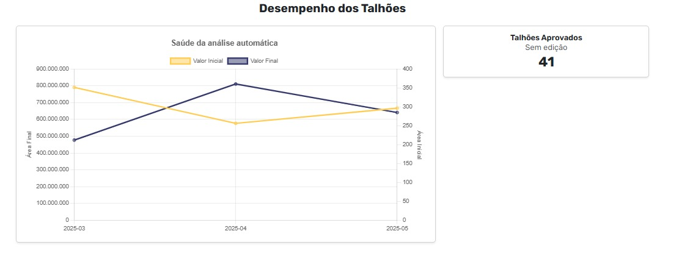
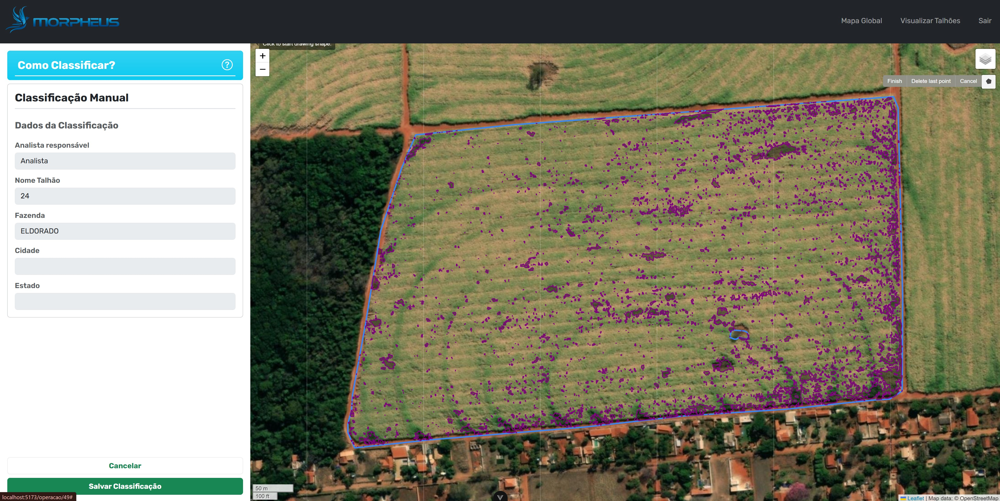

# Portfólio APIs — Banco de Dados · Isaque de Souza
<div align="center">
  

</div>

## Introdução

Estou cursando Banco de Dados desde o segundo semestre de 2023 e atualmente atuo como analista de dados na Johnson & Johnson. No dia a dia, trabalho com tecnologias como Python, SQL, AWS (Databricks), SAP ERP, Power BI e Excel para desenvolver pipelines de ETL, otimizando o fluxo e a qualidade dos dados. Além disso, elaboro relatórios de produtividade, disponibilidade e performance de máquinas, fornecendo insumos estratégicos para a tomada de decisões e a promoção de melhorias contínuas nos processos de fabricação.

## Contatos

- [LinkedIn](https://www.linkedin.com/in/seu-usuario)
- [GitHub](https://github.com/Isaque-BD)

## Principais Conhecimentos

Java · Spring Boot · SQL

---
<div id="menu"></div>

## Menu de Semestres

| Semestre | Ano | Projeto |
|----------|-----|---------|
| [1º Semestre](#1º-semestre--22023) | 2023 | PBLTeX — Sistema de Gestão Acadêmica |
| [2º Semestre](#2º-semestre--12024) | 2024 | Análise de Climas de Regiões |
| [3º Semestre](#3º-semestre--22024) | 2024 | GSW Soluções Integradas |
| [4º Semestre](#4º-semestre--12025) | 2025 | Visiona — Editor de Polígonos Geoespaciais|
| [5º Semestre](#5º-semestre--22025) | 2025 | Necto - Dashboards com base na API do JIRA|
| [6º Semestre](#6º-semestre--12026) | 2026 | Tecsys - Relatórios de Energia Elétrica (ANEEL) |
---
## 1º Semestre · 2/2023

## 🎯 Desafio Proposto
 
**Tema:** PBLTeX — Sistema de Gestão Acadêmica
 
A instituição **PBLTeX** nos desafiou a desenvolver um sistema de gestão acadêmica capaz de suportar sua metodologia diferenciada de ensino baseada em PBL (Problem Based Learning).
 
O sistema precisava contemplar diferentes níveis de permissão — **administrador**, **professor** e **aluno** — cada um com acesso restrito às suas respectivas funcionalidades. Entre as principais demandas estavam: criação de turmas, cadastro de alunos, formação de grupos e registro de notas por ciclo de entrega.

## 💡 Solução Desenvolvida
 
Para atender ao desafio proposto pela PBLTeX, desenvolvemos um **Sistema de Informação Acadêmica** voltado à gestão completa do método PBL, permitindo o acompanhamento dos ciclos de entrega, scores parciais e o cálculo do FEE (Fator de Ensino Evolutivo) de cada aluno.
 
O sistema foi construído em **Python**, com interface via terminal e seu armazenamento de dados via uma planilha do Excel, e utilizamos o **GitHub** para versionamento e controle colaborativo do código entre os membros da equipe.
 
### Funcionalidades entregues
 
O sistema contempla o controle de turmas, grupos e alunos, permitindo que o administrador organize o ambiente acadêmico de forma estruturada. Ao longo das sprints, foram implementadas as seguintes entregas:
 
- **Sprint 1** — Cadastro de alunos e professores, criação de turmas e definição dos ciclos de entrega
- **Sprint 2** — Encerramento de turmas e criação de grupos dentro das salas
- **Sprint 3** — Atribuição de scores e feedbacks pelos professores, além de geração de listagem de alunos
- **Sprint 4** — Menu centralizado de funcionalidades e exportação de relatórios por turma
### Diferenciais da solução
 
A solução foi projetada para refletir a lógica do método PBL: cada ciclo de entrega registra scores parciais que, ao final do curso, são consolidados no cálculo do FEE. Isso garante à instituição visibilidade contínua sobre a evolução dos alunos, sem depender de avaliações pontuais.
 
A exportação de dados consolidados permite que coordenadores e professores tomem decisões baseadas em métricas reais de desempenho ao longo do semestre.

**Repositório:** [API-Porygon](https://github.com/Isaque-BD/API-Porygon)

### Tecnologias Utilizadas

- **Python** — Desenvolvimento de toda a lógica do sistema
- **Trello** — Gerenciamento de tasks da equipe
- **GitHub** — Versionamento do código
- **Excel** — Armazenamento dos dados

### Contribuições Pessoais

<details>
<summary>Relatório (Dashboard de Turmas)</summary>

O código Python utiliza as bibliotecas `streamlit`, `pandas` e `plotly.express` para criar um aplicativo web interativo de relatório de turmas a partir de dados em um arquivo Excel (`infodados.xlsx`).

**Funcionalidades:**
- Carregamento e seleção de planilhas por turma
- Filtros interativos por ciclo e por aluno
- Geração de gráficos de barras (nota por ciclo e média por aluno)
- Exibição dos dados filtrados em tabela

```python
import streamlit as st
import pandas as pd
import plotly.express as px

def carregar_dados_excel():
    excel_file = pd.ExcelFile("infodados.xlsx")
    sheet_names = excel_file.sheet_names
    return excel_file, sheet_names

def filtrar_planilhas_turma(excel_file, sheet_names):
    keywords = ["turma", "classe", "grupo"]
    turma_sheets = [
        sheet_name for sheet_name in sheet_names
        if any(keyword in sheet_name.lower() for keyword in keywords)
        and "fechada" not in sheet_name.lower()
    ]
    return turma_sheets

def selecionar_planilha_turma(turma_sheets):
    return st.sidebar.selectbox("Selecione a turma:", turma_sheets)

def aplicar_filtro_alunos(df_turma):
    alunos_unicos = df_turma["Alunos"].unique()
    select_all_button = st.sidebar.checkbox("Todos os alunos")
    if select_all_button:
        return alunos_unicos
    return st.sidebar.multiselect("Selecione os alunos:", alunos_unicos)

def filtrar_dataframe(df_turma, alunos_selecionados, selected_ciclo):
    return df_turma[df_turma["Alunos"].isin(alunos_selecionados)][
        ["Alunos", selected_ciclo, "Média", "Professores", "Início do Curso", "Fim do Curso"]
    ]

def criar_graficos(df_selecao, selected_ciclo):
    col1, col2 = st.columns(2)
    col1.plotly_chart(px.bar(df_selecao, x="Alunos", y=selected_ciclo, title=f"Nota do {selected_ciclo} por aluno"))
    col2.plotly_chart(px.bar(df_selecao, x="Alunos", y="Média", title="Média por aluno"))

st.set_page_config(layout="wide", page_title="Relatórios gerais", page_icon=":bar_chart:")
st.title("Relatório das Turmas")

excel_file, sheet_names = carregar_dados_excel()
turma_sheets = filtrar_planilhas_turma(excel_file, sheet_names)
selected_sheet = selecionar_planilha_turma(turma_sheets)
df_turma = pd.read_excel("infodados.xlsx", sheet_name=selected_sheet)
colunas_ciclo = [c for c in df_turma.columns if c.lower().startswith("ciclo")]
selected_ciclo = st.sidebar.selectbox("Selecione o ciclo:", colunas_ciclo)
alunos_selecionados = aplicar_filtro_alunos(df_turma)
df_selecao = filtrar_dataframe(df_turma, alunos_selecionados, selected_ciclo)
criar_graficos(df_selecao, selected_ciclo)
st.dataframe(df_selecao)
```
https://github.com/Porygon-Users/API-Porygon/assets/145280630/2fc32e39-2c54-49bb-af2e-1423dacb13fe


</details>

<details>
<summary>Ciclo de Entrega</summary>

Script Python com `openpyxl` para gerenciar e estruturar datas de cursos e ciclos dentro de um arquivo Excel.

**Funcionalidades:**
- Seleção de turma por planilha
- Definição e validação de datas de início e término do curso
- Criação de ciclos simétricos ou personalizados
- Registro automático das datas na planilha

```python
import openpyxl
from datetime import datetime, timedelta

def adicionar_data_e_ciclos(planilha, turma_destino):
    aba_turma = planilha[turma_destino]
    ciclos = []

    while True:
        try:
            data_inicio = datetime.strptime(input("Data de início do curso (DD/MM/AAAA): "), "%d/%m/%Y")
            data_fim = datetime.strptime(input("Data de término do curso (DD/MM/AAAA): "), "%d/%m/%Y")
            if data_fim < data_inicio:
                print("Data de término anterior à de início.")
            else:
                break
        except ValueError:
            print("Formato inválido. Use DD/MM/AAAA.")

    qtd_ciclos = int(input("Quantos ciclos? "))
    # ... (lógica de criação simétrica ou manual)

    planilha.save('infodados.xlsx')
    print("Datas e ciclos adicionados com sucesso!")
```
https://github.com/Porygon-Users/API-Porygon/assets/143560101/c06cee20-d000-4dc9-b9e0-07aa02b22cb4

</details>

### Aprendizados Efetivos

Neste semestre tive meu primeiro contato com desenvolvimento de software, utilizando Python como linguagem principal. Trabalhando em grupo, aprendemos a utilizar o GitHub para versionamento de código e controle da aplicação.

### Hard Skills

| Tecnologia/Metodologia | Nota | Classificação |
|------------------------|------|---------------|
| Python | ★★★☆ | Sei fazer com ajuda |
| GitHub | ★★★☆| Sei fazer com ajuda |

### Soft Skills

| Habilidade | Descrição |
|------------|-----------|
| Conhecimento | Bastante autonomia para realizar as tasks, com pesquisas para cada dúvida. |
| Comunicação | Conflitos no grupo devido ao desbalanceamento na atuação prática de cada membro. |

---
<p align="right"><a href="#menu">🔼 Voltar ao Menu de Semestres</a></p>

## 2º Semestre · 1/2024

## 🎯 Desafio Proposto

**Tema:** Análise de Climas de Regiões

A instituição nos desafiou a desenvolver um **Sistema de Banco de Dados** capaz de receber arquivos CSV contendo dados meteorológicos de estações de monitoramento, validar seu conteúdo e gerar relatórios climáticos.

O desafio central estava na diversidade dos dados: diferentes estações de uma mesma cidade podiam apresentar formatos distintos de arquivo, exigindo leitura, validação e armazenamento estruturado das variáveis climáticas separadamente. Registros suspeitos — como temperaturas fora de faixas aceitáveis — precisavam ser isolados para revisão manual antes de entrar na base principal.

## 💡 Solução Desenvolvida
 
Para atender ao desafio proposto, desenvolvemos um **sistema desktop em Java** com conexão a banco de dados relacional via JDBC, capaz de importar, validar e processar arquivos CSV de estações meteorológicas do estado de SP.
 
O sistema foi estruturado para armazenar cada variável climática de forma independente — temperatura, umidade e demais medições em registros separados — garantindo maior flexibilidade na geração de relatórios e análises.
 
### Funcionalidades entregues
 
Ao longo das quatro sprints, o sistema evoluiu progressivamente:
 
- **Sprint 1** — Leitura e interpretação de arquivos CSV com dados meteorológicos
- **Sprint 2** — Geração de relatório de médias climáticas por cidade e período, e relatório de situação com os valores mais recentes por cidade
- **Sprint 3** — Geração de relatório para plotagem de gráfico boxplot e gerenciamento de valores limite para identificação de registros suspeitos
- **Sprint 4** — Tratamento de registros suspeitos com opção de correção ou exclusão, além da gestão de cidades, estações e unidades de medida
### Diferenciais da solução
 
Um dos pontos centrais foi o mecanismo de **validação automática** dos dados importados: registros fora dos limites configuráveis — como temperaturas acima de 60°C ou abaixo de -20°C — eram isolados em uma base separada para revisão manual, evitando que dados inconsistentes contaminassem os relatórios principais.
 
O projeto também foi documentado com manual de usuário, diagrama entidade-relacionamento e instruções de instalação, e todo o desenvolvimento foi versionado com **Git** para controle colaborativo do código.
 
**Repositório:** [API-2-semestre](https://github.com/Isaque-BD/API-2-semestre)

### Tecnologias Utilizadas

- **Java** — Linguagem principal para toda a lógica da aplicação
- **JavaFX** — Desenvolvimento da interface gráfica
- **Scene Builder** — Facilitou o desenvolvimento das telas
- **PostgreSQL** — Banco de dados relacional para armazenamento dos dados
- **GitHub** — Versionamento e gestão do código

### Contribuições Pessoais

<details>
<summary>Conexão com o Banco de Dados</summary>

A classe `DbConnection` gerencia a conexão com o banco PostgreSQL via JDBC, encapsulando as operações básicas de conexão e execução de comandos SQL.

```java
package javalee.com.bd_connection;

import java.sql.Connection;
import java.sql.DriverManager;
import java.sql.PreparedStatement;
import java.sql.SQLException;
import javalee.com.configs.*;

public class DbConnection {

    private Connection conn;

    public DbConnection() {
        ConfigBdReader config = new ConfigBdReader();
        try {
            Class.forName("org.postgresql.Driver");
            this.conn = DriverManager.getConnection(
                config.getUrlBd() + config.getNameBd(),
                config.getUserBd(),
                config.getPasswordBd()
            );
        } catch (Exception e) {
            System.out.println(e);
        }
    }

    public void Desconnect() {
        try {
            if (this.conn != null) this.conn.close();
        } catch (SQLException e) {
            e.printStackTrace();
        }
    }

    public void Save(String comando) {
        try {
            PreparedStatement stm = this.conn.prepareStatement(comando);
            stm.execute();
        } catch (SQLException e) {
            e.printStackTrace();
        }
    }
}
```

</details>

<details>
<summary>Entidade Metric</summary>

Classe de entidade simples para representar registros de métricas em banco de dados ou em memória.

```java
package javalee.com.entities;

public class Metric {

    private int idMetrica;
    private String codigo;

    public Metric(int idMetrica, String codigo) {
        this.idMetrica = idMetrica;
        this.codigo = codigo;
    }

    public Metric(String codigo) {
        this.codigo = codigo;
    }

    public String getIdMetrica() { return String.valueOf(idMetrica); }
    public void setIdMetrica(int idMetrica) { this.idMetrica = idMetrica; }
    public String getCodigo() { return codigo; }
    public void setCodigo(String codigo) { this.codigo = codigo; }
}
```

</details>

### Aprendizados Efetivos

Aprendi a estrutura de um sistema simples de CRUD e como funciona a integração entre banco de dados e a aplicação.

### Hard Skills

| Tecnologia/Metodologia | Nota | Classificação |
|------------------------|------|---------------|
| Java | ★★☆☆ | Entendi |
| PostgreSQL | ★★★☆ | Sei fazer com ajuda |
| GitHub | ★★★★ | Autonomia |
| SceneBuilder | ★★★☆ | Sei fazer com ajuda |
| JavaFX | ★★★☆ | Sei fazer com ajuda |

### Soft Skills

| Habilidade | Descrição |
|------------|-----------|
| Proatividade | Estudei bastante sobre Java, SceneBuilder, JavaFX e PostgreSQL para realizar as integrações. |
| Conhecimento | Precisei pedir bastante ajuda ao time durante o desenvolvimento das tasks. |
| Comunicação | Precisei me comunicar sobre minhas dificuldades ao longo do desenvolvimento. |

---
<p align="right"><a href="#menu">🔼 Voltar ao Menu de Semestres</a></p>

## 3º Semestre · 2/2024

## 🎯 Desafio Proposto
 
**Tema:** GSW Soluções Integradas — Captura e Armazenamento de Notícias Estratégicas
 
A empresa **GSW** nos desafiou a desenvolver uma ferramenta web para captura, armazenamento e consulta de notícias estratégicas provenientes de portais de notícias e APIs externas. O problema central estava na dificuldade de monitorar e consolidar informações dispersas em múltiplas fontes, de forma rotineira e estruturada.
 
O sistema precisava realizar web scraping de portais cadastrados, tratar variações linguísticas como regionalismos e sinônimos por meio de tags, e preparar a base de dados para uma futura aplicação de inteligência artificial e machine learning para cruzamento e análise estratégica dos dados.
 
---
 
## 💡 Solução Desenvolvida
 
Para atender ao desafio, desenvolvemos uma **aplicação web minimalista em Java** com mecanismo de web scraping para captura rotineira de notícias, sistema de tags com tratamento de sinônimos e regionalismos, e telas de consulta com filtros avançados.
 
O sistema foi projetado para escalar com grandes volumes de notícias armazenadas, utilizando apenas softwares livres e documentação completa de API com OpenAPI.
 
### Funcionalidades entregues
 
Ao longo das quatro sprints, o sistema evoluiu progressivamente:
 
- **Sprint 1** — Gerenciamento de portais de notícias com cadastro de endereços e autores, e gerenciamento de tags com suporte a conteúdos textuais livres
- **Sprint 2** — Tratamento de sinônimos de tags para contemplar regionalismos linguísticos e registro de dados provenientes dos portais via web scraping
- **Sprint 3** — Consulta e filtragem de notícias por tags tratadas e por atributos do portal de origem
- **Sprint 4** — Gerenciamento de fontes de dados via APIs externas, registro e consulta de dados provenientes dessas APIs com filtros por tags e atributos
### Diferenciais da solução
 
O principal diferencial foi o **tratamento de linguagem natural nas tags**: ao cadastrar sinônimos e variações regionais, o sistema conseguia identificar e relacionar notícias que tratavam do mesmo tema com terminologias diferentes, aumentando a precisão das consultas.
 
A arquitetura foi pensada desde o início para suportar a futura camada de inteligência artificial, com histórico estruturado de capturas e modelo de banco de dados que facilita o cruzamento de informações entre notícias, portais, jornalistas e dados de APIs externas.

**Repositório:** [Morpheus — GSW Soluções Integradas](https://github.com/Isaque-BD/morpheus)

### Tecnologias Utilizadas

- **Java** — Toda a lógica do projeto
- **MySQL** — Armazenamento e cruzamento dos dados para análises
- **Vue** — Interface para interação do usuário
- **GitHub** — Versionamento do projeto
- **Discord** — Comunicação da equipe
- **VSCode** — Ambiente de desenvolvimento
- **Maven** — Gerenciamento de dependências

### Contribuições Pessoais

<details>
<summary>Método de Filtro de Autores</summary>

Endpoint que retorna todos os autores cadastrados no sistema, com nome e ID, usando o padrão DTO para expor apenas as informações necessárias.

```java
@Service
public class NewsAuthorService {

    @Autowired
    private NewsAuthorRepository newsAuthorRepository;

    public List<NewsAuthorDTO> getAllAuthors() {
        return newsAuthorRepository.findAll().stream()
            .map(author -> new NewsAuthorDTO(author.getAutId(), author.getAutName()))
            .collect(Collectors.toList());
    }
}
```

</details>

<details>
<summary>Criação de Endpoints</summary>

Classe DTO para representar um endpoint de API com código, endereço, origem e método HTTP.

```java
public class ApiEndpointDTO {
    private int code;
    private String address;
    private String source;
    private String method;

    public void setMethod(int post, int get) {
        if (post == 1) {
            this.method = "POST";
        } else if (get == 1) {
            this.method = "GET";
        }
    }
}
```

</details>

<details>
<summary>Modelagem de Banco de Dados</summary>

Estrutura SQL para cadastro, atualização e gerenciamento de fontes de dados de APIs, com suporte a categorização por tags.

```sql
-- Armazena informações básicas sobre APIs
CREATE TABLE Api (
    api_cod  INT AUTO_INCREMENT PRIMARY KEY,
    api_name VARCHAR(30)  NOT NULL,
    api_url  VARCHAR(500) UNIQUE NOT NULL
);

-- Relação muitos-para-muitos entre Api e Tag
CREATE TABLE Api_tag (
    api_cod INT,
    tag_cod INT,
    PRIMARY KEY (api_cod, tag_cod),
    FOREIGN KEY (api_cod) REFERENCES Api(api_cod),
    FOREIGN KEY (tag_cod) REFERENCES Tag(tag_cod)
);

-- Armazena dados coletados de uma API ao longo do tempo
CREATE TABLE Data_collected_api (
    dat_coll_api_cod           INT AUTO_INCREMENT PRIMARY KEY,
    api_cod                    INT,
    dat_coll_api_registry_date TIMESTAMP NOT NULL DEFAULT CURRENT_TIMESTAMP,
    dat_coll_api_content       LONGTEXT,
    FOREIGN KEY (api_cod) REFERENCES Api(api_cod)
);
```

</details>

### Aprendizados Efetivos
Compreendi melhor os conceitos de Orientação objeto ao ponto de ter uma melhor autonomia ao desenvolver com Java, que comparado ao semestre anterior tive muito dificuldade para entender a estrutura para se desenvolver.


### Hard Skills

| Tecnologia/Metodologia | Nota | Classificação |
|------------------------|------|---------------|
| Java | ★★★☆ | Sei fazer com ajuda |
| MySQL | ★★★★ | Autonomia |
| Vue | ★★☆☆ | Entendi |
| GitHub | ★★★★ | Autonomia |

### Soft Skills

| Habilidade | Descrição |
|------------|-----------|
| Comunicação | Fui desenvolvendo ao longo do projeto, perdendo o receio de perguntar por dúvidas. |
| Paciência | Mantive o controle em situações inesperadas sem me estressar, fundamental para o trabalho em equipe. |

<p align="right"><a href="#menu">🔼 Voltar ao Menu de Semestres</a></p>

## 4º Semestre · 1/2025

## 🎯 Desafio Proposto
 
**Tema:** Visiona — Editor de Polígonos Geoespaciais
 
A empresa **Visiona** nos desafiou a desenvolver um sistema web para análise e edição de dados geoespaciais voltado ao setor agrícola. O problema central estava na necessidade de revisar e corrigir classificações de talhões agrícolas geradas por modelos de inteligência artificial, que nem sempre produzem resultados precisos sem supervisão humana.
 
O sistema precisava permitir que analistas e consultores visualizassem, editassem e exportassem polígonos em formato GeoJSON diretamente em um mapa interativo, com diferentes níveis de permissão para administradores, analistas e consultores.
 
---
 
## 💡 Solução Desenvolvida
 
Para atender ao desafio, desenvolvemos uma **plataforma web** com mapa interativo para visualização e edição de talhões agrícolas em formato GeoJSON, integrada a dashboards de monitoramento de produtividade e métricas de qualidade das correções realizadas.
 
O sistema foi estruturado com controle de permissões por perfil de usuário, garantindo que cada nível de acesso interagisse apenas com as funcionalidades pertinentes à sua função.
 
### Funcionalidades entregues
 
Ao longo das três sprints, o sistema evoluiu progressivamente:
 
- **Sprint 1** — Cadastro de talhões via upload de GeoJSON, visualização em mapa interativo, filtros por atributos e exibição de informações detalhadas dos talhões
- **Sprint 2** — Edição de polígonos no mapa, histórico de alterações, exportação dos talhões revisados em GeoJSON e dashboards com métricas de produtividade dos analistas
- **Sprint 3** — Gerenciamento de usuários, atribuição de permissões por perfil e notificações sobre talhões pendentes de revisão
### Diferenciais da solução
 
Um dos principais diferenciais foi o **rastreamento completo das alterações**: cada edição realizada nos polígonos ficava registrada no histórico, permitindo auditoria e garantindo a rastreabilidade das correções feitas sobre as classificações da IA.
 
Além disso, os dashboards ofereciam visibilidade em tempo real sobre o desempenho dos analistas — métricas de tempo, volume de edições e qualidade das revisões — contribuindo diretamente para o refinamento contínuo dos modelos de inteligência artificial utilizados no mapeamento agrícola.

**Repositório:** [Morpheus — Visiona](https://github.com/Isaque-BD/FATEC-API-4-SEMESTRE)

### Tecnologias Utilizadas

- **Java** — Toda a lógica do projeto
- **PostgreSQL** — Armazenamento e persistência dos dados geoespaciais
- **PostGIS** — Suporte a dados espaciais e consultas geográficas
- **Vue.js** — Interface para interação do usuário
- **Leaflet** — Visualização e edição de mapas e polígonos
- **GitHub** — Versionamento do projeto
- **Maven** — Gerenciamento de dependências


## Contribuições pessoais

<details>
<summary>Implementação da lógica de cálculo das métricas</summary>

Fui responsável pela implementação da lógica de cálculo das métricas utilizadas nos dashboards, desenvolvida com **queries nativas em Java utilizando Spring Data JPA**. As consultas foram escritas diretamente em SQL com foco em **performance**, **precisão nos cálculos** e flexibilidade para filtros dinâmicos.

### Qualidade das revisões
Desenvolvimento de queries responsáveis por classificar cada correção conforme a quantidade de revisões realizadas:

- **Ideal** — 1 revisão  
- **Aceitável** — até 2 revisões  
- **Ruim** — 3 ou mais revisões  

Essas métricas podem ser analisadas tanto por **analista individual** quanto de forma consolidada para **toda a equipe**.

### Desempenho dos analistas
Implementação de consultas para cálculo da produtividade dos analistas com base em:

- **Área revisada ÷ tempo gasto**
- Área total **aprovada**
- Área total **pendente**
- Área total **rejeitada**

Permitindo comparar desempenho individual e gerar indicadores médios da equipe.

### Ciclo dos talhões
Construção de query com múltiplos filtros dinâmicos para alimentar a tabela detalhada de acompanhamento operacional dos talhões, contendo:

- tempo de análise
- tempo de revisão
- quantidade de interações
- status atual
- analista responsável
- consultor responsável

### Evolução mensal
Implementação da consulta que compara a **área inicial classificada pela IA** com a **área final após revisão humana** nos últimos 3 meses.

Essa informação é utilizada no dashboard para alimentar o gráfico de acompanhamento da **saúde da análise automática**, permitindo visualizar a diferença entre a classificação automática e o resultado final validado manualmente.

## Exemplos de queries implementadas

```java
@Query(value = """
    WITH revisoes_por_classificacao AS (
        SELECT 
            cc.id_controle_classificacao,
            COUNT(rcm.id_revisao_classificacao_manual) AS total_revisoes
        FROM controle_classificacao cc
        LEFT JOIN revisao_classificacao_manual rcm 
            ON cc.id_controle_classificacao = rcm.id_controle_classificacao
        WHERE (:idAnalista IS NULL OR cc.id_analista = :idAnalista)
        GROUP BY cc.id_controle_classificacao
    )
    SELECT
        CASE
            WHEN total_revisoes = 1 THEN 'Ideais'
            WHEN total_revisoes <= 2 THEN 'Aceitaveis'
            ELSE 'Ruim'
        END AS classificacao_revisao,
        COUNT(*) AS quantidade
    FROM revisoes_por_classificacao
    GROUP BY classificacao_revisao
""", nativeQuery = true)
List<Object[]> getQualityAnalysisByAnalyst(@Param("idAnalista") Long idAnalista);

@Query(value = """
    WITH analistas_data AS (
        SELECT
            cc.id_analista,
            SUM(t.area) AS total_area_aprovada,
            SUM(cc.time_spent_manual) AS total_tempo_gasto,
            CASE
                WHEN SUM(cc.time_spent_manual) = 0 THEN NULL
                ELSE SUM(t.area) / SUM(cc.time_spent_manual)
            END AS area_por_tempo
        FROM controle_classificacao cc
        JOIN talhoes t 
            ON cc.id_talhao = t.id_talhao
        WHERE t.estado = 'APPROVED'
        GROUP BY cc.id_analista
    )
    SELECT COALESCE(AVG(area_por_tempo), 0)
    FROM analistas_data
""", nativeQuery = true)
Double getAverageAnalystProductivity();

@Query(value = """
    WITH meses AS (
        SELECT generate_series(
            date_trunc('month', CURRENT_DATE) - interval '2 months',
            date_trunc('month', CURRENT_DATE),
            interval '1 month'
        ) AS mes
    ),
    classificacoes_com_datas AS (
        SELECT 
            DATE_TRUNC('month', cc.date_time_created) AS mes,
            cm.area AS area_inicial,
            rcm.area_metros_quadrados AS area_final
        FROM controle_classificacao cc
        JOIN classificacao_manual cm 
            ON cm.id_controle_classificacao = cc.id_controle_classificacao
        LEFT JOIN LATERAL (
            SELECT 
                ST_Area(ST_Transform(coordenadas_destaque, 5880)) AS area_metros_quadrados
            FROM revisao_classificacao_manual rcm
            WHERE rcm.id_controle_classificacao = cc.id_controle_classificacao
              AND coordenadas_destaque IS NOT NULL
            ORDER BY rcm.id_revisao_classificacao_manual DESC
            LIMIT 1
        ) rcm ON TRUE
        WHERE cc.date_time_created >= date_trunc('month', CURRENT_DATE) - interval '2 months'
    )
    SELECT 
        TO_CHAR(m.mes, 'YYYY-MM') AS month,
        COALESCE(SUM(c.area_inicial), 0) AS initial_area,
        COALESCE(SUM(c.area_final), 0) AS final_area
    FROM meses m
    LEFT JOIN classificacoes_com_datas c 
        ON m.mes = c.mes
    GROUP BY m.mes
    ORDER BY m.mes
""", nativeQuery = true)
List<Object[]> findMonthlyAreaData();
```

</details>

<details>
<summary>Endpoints para operações de talhões</summary>

Implementei os endpoints de atualização e download de talhões, envolvendo criação de DTOs, reestruturação de respostas e correções de tipos. As principais mudanças foram:

**Download em GeoJSON — formato MANUAL**

Criação do `ManualDTO` representando a coleção de features da classificação manual, e do `FieldPropertiesManualDto` com mapeamento das propriedades para os nomes esperados pelo padrão GeoJSON da Visiona (`NM_TL`, `AREA_M2`, `CLASSE`):

```java
public class ManualDTO {
    private final String type = "FeatureCollection";
    private final String name = "MAPA_CLASSIF_MANUAL";
    private CrsDto crs;
    private List<FeatureManualDto> features;
}
```

```java
@JsonPropertyOrder({ "NM_TL", "AREA_M2", "CLASSE" })
public class FieldPropertiesManualDto {

    @JsonProperty("NM_TL")
    private String fieldName;

    @JsonProperty("AREA_M2")
    private BigDecimal area;

    @JsonProperty("CLASSE")
    private String classe;
}
```

</details>
</details>
<details>
<summary>Filtros e buscas de talhões</summary>
Implementei o backend de filtros dinâmicos para a listagem de talhões no mapa, permitindo que o front-end filtre por nome, solo, status, cultura, safra e fazenda via query params opcionais.
 
A query no repositório foi atualizada para aceitar os parâmetros com `COALESCE`, ignorando automaticamente filtros não informados:
 
```java
WHERE
  (COALESCE(:nome, '') = '' OR LOWER(t.nome) LIKE LOWER(CONCAT('%', :nome, '%'))) AND
  (COALESCE(:soil, '') = '' OR LOWER(so.nome) LIKE LOWER(CONCAT('%', :soil, '%'))) AND
  (COALESCE(:status, '') = '' OR LOWER(t.estado) LIKE LOWER(CONCAT('%', :status, '%'))) AND
  (COALESCE(:culture, '') = '' OR LOWER(c.nome) LIKE LOWER(CONCAT('%', :culture, '%'))) AND
  (COALESCE(:harvest, '') = '' OR LOWER(t.safra) LIKE LOWER(CONCAT('%', :harvest, '%'))) AND
  (COALESCE(:farmName, '') = '' OR LOWER(fa.nome) LIKE LOWER(CONCAT('%', :farmName, '%')))
```
 
O controller foi ajustado para receber todos os parâmetros como `@RequestParam(required = false)`, mantendo a compatibilidade com chamadas sem filtro:
 
```java
@GetMapping("/featureCollectionSimple")
public ResponseEntity<FeatureCollectionSimpleDTO> getAllFeatureCollectionSimpleDTO(
    @RequestParam(required = false) String name,
    @RequestParam(required = false) String soil,
    @RequestParam(required = false) String status,
    @RequestParam(required = false) String culture,
    @RequestParam(required = false) String harvest,
    @RequestParam(required = false) String farmName
) {
    FeatureCollectionSimpleDTO featureCollection = fieldService.getAllFeatureCollectionSimpleDTO(
        name, soil, status, culture, harvest, farmName
    );
    return ResponseEntity.ok(featureCollection);
}
```
 
</details>

### Aprendizados Efetivos
Nesse semestre o foco principal da API foi na parte de desenvolvimento do Front End, que é uma parte não muito do meu interesse no desenvolvimento, ao ponto de eu ficar apenas focado na parte do Back-End neste projeto e não ter nenhum envolvimento no Front-End ao decorrer do projeto. Minhas únicas interações na parte do Front foi durante as aulas de Laboratório com o professor Mineda, na qual eu entendi um pouco a parte de integração do Back com o Front, que até então não era de meu conhecimento. 

### Hard Skills
| Tecnologia/Metodologia | Nota | Classificação |
|------------------------|------|---------------|
| Java | ★★★☆ | Sei fazer com ajuda |
| PostgreSQL | ★★★★ | Autonomia |
| GitHub | ★★★★ | Autonomia |
| Vue | ★★☆☆ | Entendi |

### Soft Skills

| Habilidade | Descrição |
|------------|-----------|
| Proatividade | Durante a API eu poderia ser mais proativo na realização das issues, mas como meu receio era muito grande por ser tasks relacionadas a Front-End eu não me ofericia para pegar, que foram as mais difícies nesse semestre e fiquei no conforto do Back-End. |
| Paciência | Meu controle através de conflitos foi essencial para equipe, pois tivemos algumas intrigas por parte de alguns integrantes, minha paciência em não envolver com qualquer tipo de intriga foi relevante para não desestabilizar a equipe mais ainda.|

<p align="right"><a href="#menu">🔼 Voltar ao Menu de Semestres</a></p>

## 5º Semestre · 2/2025

## 🎯 Desafio Proposto

**Tema:** Necto — Jibóia, Sistema de ETL para Dados do Jira

A empresa **Necto** nos desafiou a criar uma ferramenta analítica que consumisse dados diretamente pela API do Jira, consolidando-os em um data warehouse para geração de indicadores, dashboards e boards sobre o andamento de projetos.

O desafio estava em transformar dados brutos e dispersos do Jira em métricas úteis e estruturadas, dando visibilidade sobre o andamento, esforço e performance das equipes de forma centralizada.

---

## 💡 Solução Desenvolvida

Desenvolvemos o **Jibóia**, um sistema de ETL que extrai dados da API do Jira, transforma as informações brutas e as carrega em um data warehouse, permitindo a geração de dashboards detalhados tanto em nível de projetos quanto de issues.

O sistema conta com controle de acesso por perfil de usuário — gerente, líder e membro de equipe — cada um com permissões condizentes com seu cargo.

### Funcionalidades entregues

Ao longo das três sprints, o sistema evoluiu progressivamente:

- **Sprint 1** — Listagem de projetos com nome, datas e quantidade de issues, visualização de horas registradas por projeto e dashboard inicial com métricas agregadas
- **Sprint 2** — Listagem de issues com autor, ID e data de criação, tempo gasto e data de início por issue, cadastro de usuários e autenticação com controle de permissões por cargo
- **Sprint 3** — Dashboard com membros ativos e horas trabalhadas, filtros por data e membro, taxa de conclusão de issues, tempo médio de resolução e cálculo do valor total de horas gastas por projeto

### Diferenciais da solução

O principal diferencial foi a camada de **ETL integrada à API do Jira**: os dados eram extraídos automaticamente, tratados e armazenados no data warehouse, eliminando a necessidade de exportações manuais. Isso permitiu que gestores e líderes acompanhassem o andamento dos projetos em tempo real, com métricas de custo e produtividade por desenvolvedor.

---


**Repositório:** [Jibóia — Necto](https://github.com/Isaque-BD/FATEC-API-5-SEMESTRE)

## Tecnologias Utilizadas

- **Python** — Desenvolvimento da lógica de ETL e processamento dos dados
- **TypeScript** — Tipagem estática no front-end
- **Vue.js** — Interface para interação do usuário e visualização dos dashboards
- **Jira** — Fonte dos dados consumidos via API
- **GitHub** — Versionamento do projeto
- **Figma** — Prototipação das interfaces
- **Amazon AWS** — Infraestrutura de cloud para deploy e armazenamento
- **PostgreSQL** — Data warehouse para armazenamento e consolidação dos dados
- **Django** — Framework back-end para a API REST
- **Docker** — Containerização e padronização do ambiente
- **DBeaver** — Gerenciamento e consulta do banco de dados

---

## Contribuições Pessoais

<details>
<summary>Modelagem do Data Warehouse</summary>
Desenvolvi a modelagem do Data Warehouse do projeto seguindo o esquema **Star Schema**, com uma tabela fato central e quatro dimensões ao redor.
 
A tabela `Fato_Projeto` centraliza as métricas principais — tempo gasto, quantidade de issues e as chaves estrangeiras para as dimensões. As dimensões modeladas foram:
 
- **Dim_Projeto** — armazena o id, chave e nome do projeto no Jira
- **Dim_Usuário** — armazena o `account_id` e o nome de exibição do usuário
- **Dim_Data** — armazena a data de criação (`jira_created_at`), data de início e fim
- **Dim_issue** — armazena o id e a chave da issue, relacionada ao projeto
- **Dim_detalhes_issues** — detalha cada registro de trabalho por issue, com nome do autor, data e tempo gasto em segundos


</details>
<details>
<summary>Métrica de quantidade de issues por projeto</summary>
Implementei o endpoint que retorna a quantidade de issues agrupadas por projeto, consultando diretamente o MongoDB via agregação. O endpoint foi registrado no `urls.py` e exposto via GET:
 
```
GET /project/count_issues_grouped_by_project
```
 
</details>
<details>
<summary>Métrica de quantidade de issues por usuário e horas totais</summary>
Implementei o endpoint que retorna, para cada usuário, a quantidade de issues trabalhadas e o total de minutos gastos, utilizando um pipeline de agregação no MongoDB com `$unwind`, `$group` e `$sort`:
 
```python
def count_issues_by_user_and_total_hours(request):
    pipeline = [
        { "$unwind": "$issues" },
        { "$unwind": "$issues.author_logs" },
        {
            "$group": {
                "_id": "$issues.author_logs.display_name",
                "issue_count": { "$sum": 1 },
                "total_time_spent_minutes": {
                    "$sum": { "$divide": ["$issues.author_logs.time_spent_seconds", 60] }
                }
            }
        },
        { "$sort": { "total_time_spent_minutes": -1 } }
    ]
 
    results = list(project_collections.aggregate(pipeline))
    formatted = [
        { "nome": r["_id"], "quantidade_issues": r["issue_count"], "total_horas": round(r["total_time_spent_minutes"], 2) }
        for r in results
    ]
    return JsonResponse(formatted, safe=False)
```
 
</details>


## Aprendizados Efetivos

Neste semestre atuei pela primeira vez como **Scrum Master**, cargo que assumi por decisão da equipe mesmo não sendo meu perfil natural. Foi um desafio significativo: além das dificuldades técnicas com Python e MongoDB, enfrentei obstáculos na gestão de pessoas, na garantia das entregas e no entendimento do produto. Um fator externo também impactou o ritmo da equipe — o delay para receber acesso à API do Jira, o que atrasou a análise dos dados e a definição dos indicadores.
 
Na segunda sprint, cedi o cargo de SM para atuar como desenvolvedor, o que me permitiu focar nas entregas técnicas. Com as tecnologias já mais dominadas, o time evoluiu bem — até percebermos que a escolha do MongoDB havia sido um erro: não consultamos o cliente sobre o banco utilizado no ambiente deles, o que resultou na fusão com a equipe Jibóia. Nessa integração, fiquei responsável pela parte de **Migrations**, que gerencia as mudanças na base de dados. Tive dificuldades de entendimento sobre o que deveria ser feito, o que limitou minha contribuição nessa frente. 

Do ponto de vista técnico, os maiores aprendizados foram o contato com o **Docker** - ferramenta que elimina a dependência de configurações locais ao rodar o projeto em um ambiente virtualizado - e a modelagem de **Data Warehouse**, onde aprendi os conceitos de **Start Shcema** e **Snowflake Schema**. O Snowflake se destaca pela estrutura totalmente normalizada, facilitando manutenção e mudanças a longo prazo, mas com desempenho inferior devido ao alto número de joins. Já o Star Schema é otimizado para consultas em grandes volumes de dados justamente por minimizar os joins

## Hard Skills

| Tecnologia/Metodologia | Nota | Classificação |
|---|---|---|
| Python | ★★★☆ | Sei fazer com ajuda |
| TypeScript | ★☆☆☆ | Ouvi falar |
| Vue.js | ★★☆☆ | Entendi |
| Django | ★★★☆ | Sei fazer com ajuda |
| PostgreSQL | ★★★★ | Autonomia |
| Docker | ★★★☆ | Sei fazer com ajuda |
| GitHub | ★★★★ | Autonomia |

---

## Soft Skills

| Habilidade | Descrição |
|---|---|
| Comunicação | Atuando como Scrum Master na primeira sprint, precisei me comunicar com a equipe para alinhar entregas e gerenciar dificuldades técnicas e de produto. Foi um desafio, pois gestão de pessoas não é meu perfil natural, mas foi uma experiência importante para desenvolver essa habilidade. |
| Trabalho em equipe | Na segunda sprint, a equipe se fundiu com a Jibóia após identificarmos que a escolha do MongoDB foi inadequada para o ambiente do cliente. Essa integração exigiu adaptação rápida e colaboração com pessoas de fora do time original. |
| Proatividade | Ao perceber que o cargo de SM não estava rendendo os resultados esperados, tomei a iniciativa de ceder a posição para atuar como desenvolvedor, contribuindo de forma mais efetiva para as entregas técnicas da equipe. |
| Resolução de problemas | Diante das dificuldades com as Migrations, busquei entender melhor o que deveria ser feito, mesmo sem muito sucesso na entrega. A situação evidenciou a importância de validar decisões técnicas com o cliente desde o início, como a escolha do banco de dados. |

<p align="right"><a href="#menu">🔼 Voltar ao Menu de Semestres</a></p>

## 6º Semestre · 1/2026

## 🎯 Desafio Proposto

**Tema:** Thunderstone — Dimensionamento do Sistema de Distribuição de Energia

A empresa **Tecsys** nos desafiou a dimensionar o sistema de distribuição de energia para viabilizar a expansão de suas tecnologias de telemetria. O principal obstáculo a ser superado era a padronização dos cálculos e a alta complexidade no tratamento do grande volume de dados da ANEEL.

O desafio estava em transformar dados massivos e não estruturados em visualizações estratégicas que permitissem identificar geograficamente as seções mais críticas da rede elétrica.

---

## 💡 Solução Desenvolvida

Desenvolvemos uma plataforma capaz de processar os dados massivos e não estruturados da ANEEL, padronizando o cálculo de perdas e traduzindo essas informações em visualizações estratégicas — como heatmaps e rankings — que destacam geograficamente as seções mais críticas da rede de distribuição.

### Funcionalidades entregues

Ao longo das três sprints, o sistema evoluiu progressivamente:

- **Sprint 1** — Ranking de Índice de Criticidade por conjunto elétrico, gráfico de barras por score SAM, gráfico de perdas técnicas e não técnicas (PT/PNT) e ranking dos 10 conjuntos com maior extensão de média tensão (TAM)
- **Sprint 2** — Heatmap georeferenciado por Índice de Criticidade, geração automática de análise por distribuidora, exportação de relatório PDF consolidado e autenticação com controle de acesso por credenciais corporativas, além de envio do relatório por e-mail
- **Sprint 3** — Conformidade com LGPD, histórico de auditoria de acessos e ações na plataforma, e predição de seções com maior risco de falhas e multas futuras

### Diferenciais da solução

O principal diferencial foi a **geração automatizada de relatórios PDF**: ao selecionar uma distribuidora, o sistema processa todos os indicadores e entrega o material de apresentação pronto, sem nenhuma ação manual. Isso permite que consultores de vendas foquem na abordagem comercial sem depender de suporte técnico.

A camada de **predição** — identificando tendências e seções com maior probabilidade de falhas futuras — posicionou a solução como uma ferramenta estratégica para venda preventiva de sensores inteligentes.

---

**Repositório:** [Thunderstone — Tecsys](https://github.com/Isaque-BD/FATEC-API-6-SEMESTRE)

## Tecnologias Utilizadas

- **FastAPI** — Framework back-end para a API REST
- **Vue.js** — Interface para interação do usuário e visualização dos dashboards
- **MongoDB** — Armazenamento dos dados brutos da ANEEL
- **PostgreSQL** — Banco de dados relacional para dados estruturados
- **Celery** — Processamento assíncrono de tarefas pesadas
- **Redis** — Broker de mensagens para o Celery
- **DBeaver** — Gerenciamento e consulta do banco de dados
- **Google Colab** — Experimentação e análise exploratória dos dados
- **GitHub** — Versionamento do projeto

---

## Contribuições Pessoais

<details>
<summary>Endpoint de cálculo de Perdas Técnicas e Não Técnicas (PT/PNT)</summary>
Implementei o endpoint e a lógica de cálculo das perdas técnicas (PT) e não técnicas (PNT) por conjunto elétrico, cruzando dados de três coleções do MongoDB: `circuitos_mt`, `conjuntos` e `segmentos_mt_tabular`.
 
O cálculo percorre os segmentos de média tensão para mapear quais circuitos pertencem a cada conjunto, acumula as perdas por coluna e converte os valores de kWh para MWh. O resultado é ordenado pelo volume de PNT e retorna o percentual de cada tipo de perda sobre o total:
 
```python
def calculate_pt_pnt(job_id: str) -> list[dict]:
    # Carrega CTMT, CONJ e SSDMT do MongoDB
    # Mapeia circuitos -> conjuntos via segmentos de MT
    # Acumula PT, PNT e energia injetada por conjunto
    results.append({
        'conjunto': name_by_conj.get(conj_cod, conj_cod),
        'pt_mwh': round(pt_mwh, 4),
        'pnt_mwh': round(pnt_mwh, 4),
        'energia_injetada_mwh': round(ene_mwh, 4),
        'pct_pt': round(pct_pt, 4) if pct_pt is not None else None,
        'pct_pnt': round(pct_pnt, 4) if pct_pnt is not None else None,
    })
```
 
O endpoint foi registrado no `app.py` e exposto via GET:
 
```
GET /pt-pnt?job_id={job_id}
```
 
</details>
<details>
<summary>Task Celery de renderização do gráfico PT/PNT</summary>
Implementei a task Celery `etl.render_pt_pnt` responsável por gerar e salvar o gráfico de barras comparando as perdas técnicas e não técnicas por conjunto elétrico. A task foi integrada ao fluxo do `trigger_pipeline_flow`, executando automaticamente após o cálculo do PT/PNT.
 
O gráfico é gerado com **Matplotlib** e salvo como PNG em `output/images`, com o nome no formato `pt_pnt_{sig_agente}_{ano}.png`:
 


 
</details>
<details>
<summary>Renderização do gráfico SAM no pipeline</summary>
Implementei a renderização do gráfico de SAM (Score de Adequação de Mercado) — gráfico de barras ordenado pelos conjuntos com maior score — integrando a task ao pipeline de geração automática de relatórios. O gráfico inclui data labels nas barras para facilitar a leitura dos valores:
 


 
</details>
<details>
<summary>Implementação do modelo de Machine Learning (Prophet)</summary>
Responsável pelo treinamento e integração do modelo de Machine Learning preditivo ao projeto. Utilizei o Prophet (biblioteca de séries temporais do Meta) para identificar padrões históricos nas métricas de DEC e FEC e gerar previsões para 1 ano à frente.
 
Os modelos treinados foram serializados em arquivos `.pkl` e adicionados ao repositório na pasta `backend/models`:
 
- `prophet_models.pkl` — modelos treinados por conjunto elétrico
- `prophet_forecasts.pkl` — previsões geradas
- `df_hierarchical_agg.pkl` — dados históricos agregados hierarquicamente
O notebook de análise e treinamento foi disponibilizado na pasta `colabs/Análise_Temporal_DEC_e_FEC.ipynb`.


</details>

---

## Aprendizados Efetivos

Este foi um dos semestres mais desafiadores e enriquecedores da minha trajetória, principalmente pelo volume massivo de dados da ANEEL e pela necessidade de interpretá-los para gerar métricas relevantes ao cliente.

Um dos principais aprendizados foi o desenvolvimento de um modelo de Machine Learning para predição temporal. Aprendi a criar um modelo próprio que, com base em dados históricos, identifica padrões e projeta valores para até 1 ano à frente. No projeto, esse modelo foi aplicado às métricas de DEC (Duração Equivalente de Interrupção por Unidade Consumidora) e FEC (Frequência Equivalente de Interrupção por Unidade Consumidora), indicadores regulatórios que medem a qualidade do fornecimento de energia elétrica. Todos os dados utilizados foram coletados diretamente do portal da ANEEL (Agência Nacional de Energia Elétrica).

Outro aprendizado relevante foi a LGPD (Lei Geral de Proteção de Dados) e sua aplicação prática em projetos de software. Como o sistema lida com dados pessoais, foi necessário garantir transparência sobre quais dados são coletados, com qual finalidade e de que forma são utilizados, além de disponibilizar ao usuário a opção de aceitar ou recusar os termos de uso. Esse processo demonstrou a importância da responsabilidade dos desenvolvedores na criação de soluções alinhadas às exigências legais e à proteção da privacidade dos usuários.

Por fim, aprendi técnicas de ETL (Extract, Transform and Load) voltadas para o processamento de grandes volumes de dados. Com tabelas contendo milhões de registros, a estratégia tradicional de carregamento se mostrou inviável devido ao elevado consumo de memória e tempo de execução. Para contornar esse problema, foi utilizada a técnica de processamento por chunks, que consiste em dividir os dados em lotes menores, processar cada lote individualmente e persistir os resultados de forma incremental. Essa abordagem reduziu significativamente o consumo de recursos da aplicação e tornou o processo de carga mais eficiente e escalável.

---

## Hard Skills

| Tecnologia/Metodologia | Nota | Classificação |
|---|---|---|
| FastAPI | ★★★☆ | Sei fazer com ajuda |
| Vue.js | ★★☆☆ | Entendi |
| MongoDB | ★★☆☆ | Sei fazer com ajuda |
| PostgreSQL | ★★★★ | Autonomia |
| Celery | ★★★☆ | Sei fazer com ajuda |
| Redis | ★★☆☆ | Entendi |
| GitHub | ★★★★ | Autonomia |

---

## Soft Skills

| Habilidade | Descrição |
|---|---|
| Comunicação | Sinto que eu melhorei bastante minha comunicação com o grupo, já que já tinhamos trabalhado antes, então minha comunicação foi bem mais fluída no decorrer desse semestre |
| Trabalho em equipe | O desenvolviemnto da equipe foi uma ótima experiência todos contribuiram e foram muito proativo para conseguir realizar as entregas de cada Sprint. |
| Proatividade | Tomei como iniciativa o desenvolvimento do Machine Learning no projeto. |

<p align="right"><a href="#menu">🔼 Voltar ao Menu de Semestres</a></p>
